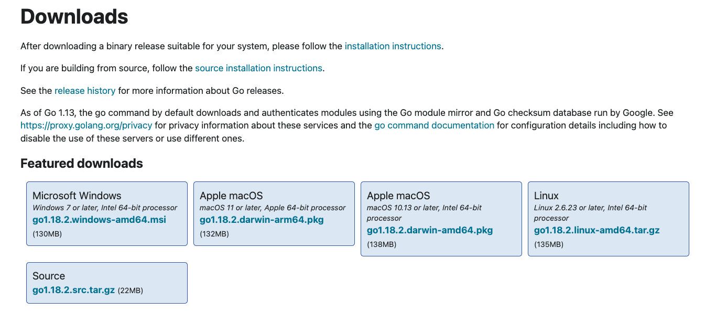
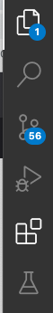
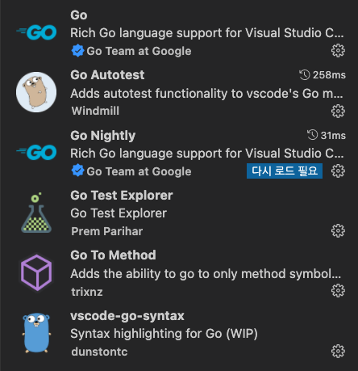

# 설치 

- Go는 Mac, Windows, Linux 등에 설치가 가능하다. 
- 다운로드 사이트에서 https://go.dev/dl/ 다운로드 받고 설치하자. 



- 위 다운로드를 직접 선택할 수 있다. 
- 혹은 https://go.dev/doc/install 에서 직접 다운로드하고, 설치 위치등을 파악할 수 있다. 
  
## Linux

- 리눅스는 다운로드 사이트에서 파일을 다운로드 받아 설치한다. 

### 이전 파일 제거 및 신규 바이너리 압축 해제 

- 이전에 설치된 Go를 우선 제거해준다. 
  - /usr/local/go 폴더가 미리 존재한다면 제거해준다. 
  - /usr/loca 에 다운로드된 파일의 압축을 해제한다. 

```go
$ rm -rf /usr/local/go && tar -C /usr/local -xzf go1.18.2.linux-amd64.tar.gz
```

- 위 커맨드를 실행하기 위해서는 sudo를 통해서 루트 권한으로 작업해야한다. 
- 주의: 이미 설치되어 있는 경로에 압축을 해제하지 마라. 이런경우 Go 설치 버전이 깨질 수 있다. 

### 환경 변수 등록하기 

- /usr/local/go/bin 을 PATH 환경 변수에 추가한다. 
- $HOME/.profile 혹은 /etc/profile 등에 아래와 같이 추가하자. 

```go
export PATH=$PATH:/usr/local/go/bin
```

- 저장된 프로파일을 갱신한다. 

```go
$ source $HOME/.profile
```

### 설치된 Go 버젼을 확인한다. 

```go
$ go version
```


## Mac 에 설치하기 

### 다운로드 및 설치 

- 패키지 파일을 download 사이트에서 다운 받고 설치한다. 
- 설치하고 나면 다음 경로에 다운로드 된다. 

```go
/usr/local/go
```

- 패키지는 /usr/local/go/bin 디렉토리를 환경변수에 넣어야한다.
- 설치 이후에 터미널을 다시 열어 적용 여부를 확인한다. 

### 설치된 Go 버전 확인 

```go
$ go version
```

## Windows 에 설치하기 

### MSI 파일을 다운로드 받고 설치한다. 

- 다운로드에서 설치 파일을 다운로드 받고 실행한다. 
- 기본적으로 Go는 Program Files 혹은 Program Files (x86) 에 설치한다. 

### 설치된 Go검증

- Windows에서 "시작" 메뉴 클릭
- 검색창에서 cmd를 타이핑 하여 커맨드 창을 연다. 
- go version 을 실행하여 버젼을 확인한다. 

## IDEA 설치하기 

- Go를 이용하여 개발하기 위해서 VisualStudio Code 를 강력 추천한다. 
- https://code.visualstudio.com/download 에서 각 환경에 맞는 실행 파일을 다운로드 받고 설치한다. 

### VS Code Extension 

- Go 언어를 통해 개발을 하기 위해서는 VS 창에서 Extension 아이콘을 클릭하고 다음 확장팩을 설치하자. 



- 위와 같이 하이라이트된 아이콘을 클릭한다.



- Go: 
  - VS Code에 Go 언어를 풍부하게 지원하는 확장팩이다. 
- Go Autotest
  - vscode의 Go mode에 자동 테스트 기능 추가 
- Go Test Explorer
  - Go 테스트 내용을 확인하는 기능
- Go To Method
  - 활성 문서에 선언된 메서드에 이동을 쉽게 도와주는 기능이다.
- vscode-go-syntax
  - 신텍스 하이라이트 수행한다. 

