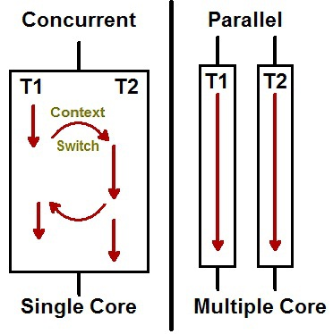

# Goroutine

- Go는 동시성 언어이다.
- concurrency(동시성)라는 용어로 동시성은 한번에 여러 일을 처리하는 것을 말한다. 
- parallelism(병렬성)라는 용어로 병렬성은 동시에 어려 일을 처리하는 것이다. 
- 둘은 비슷하게 보이지만 실제로는 다른 것이다. 동시성은 한번에 여러일을 처리하는 것이고, 병렬성은 동일한 시간에 여러일을 처리하는 것이다. 



from: https://www.codeproject.com/Articles/1267757/Concurrency-vs-Parallelism

## Goroutine 은 무엇인가? 

- goroutine은 함수 혹은 메소드로, 다름 함수 혹은 메소드와 동시에 수행되는 것이다. 
- goroutine은 가벼운 threads와 유사하다. 
- 다만 쓰레드에 비해서 goroutine은 매우 비용이 작게 든다. 
- 하나의 go 프로그램에서 수천개의 goroutine 여러개를 수행할 수 있다. 

## Goroutine의 장점 

- goroutine은 쓰레드에 비해서 가볍다. (쓰레드보다 스택 크기를 최소화 할 수 있다. 불과 몇 kb정도만 소요된다.)
- 더 적은 수의 OS쓰레드로 다중화 된다. (수천개의 goroutine가 하나의 쓰레드에 있을 수 있다.)
- goroutine은 채널을 통해서 상호같 통신이 가능하다. 채널은 공유 메모리에 접근할때 race 컨디션을 해소한다. 

## 사용법

- go 루틴을 사용하기 위해서 함수나, 메소드를 실행할때 앞에 go 메소드명 형태로 사용하면 된다. 

```go
package main

import "fmt"

func greeting() {
  fmt.Println("Hello World. I'm go routine.")
}

func main() {
  go greeting()
  fmt.Println("I'm a main function")
}
```

- 위 결과는 다음과 같다. 

```go
I'm a main function
Hello World. I'm go routine.
```

- 위 결과는 main함수가 종료되기 전에 greeting() 고루틴이 수행되면 둘다 출력되게 된다. 
  
```go
I'm a main function
```

- 그러나 위 결과 main함수가 종료되어 버리면 greeting() 고루틴은 종료 되어 버린다. 그래서 main 함수의 내용만 출력된다. 

- 항상 정상적으로 수행되도록 하기 위해서 다음과 같이 main함수를 수정하면 된다. 

```go
package main

import (
  "fmt"
  "time"
)

func greeting() {
  fmt.Println("Hello World. I'm go routine.")
}

func main() {
  go greeting()
  time.Sleep(1 * time.Second)
  fmt.Println("I'm a main function")
}
```

- 위와 깉이 1초 이후에 수행되면 다음 결과를 항상 볼 수 있다. 

```go
Hello World. I'm go routine.
I'm a main function
```

## WrapUp

- go routine은 함수 혹은 메소드에 go 키워드를 이용하여 실행할 수 있다. 
- 동시적으로 메소드가 수행되며, 메인 쓰레드가 종료되면 goroutine 역시 종료된다. 

