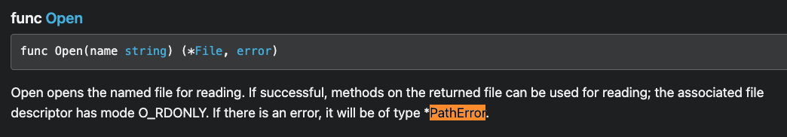

# Error Handling

- 에러는 프로그램에서 잘못된 상태를 나타낸다. 
- Go에서 에러는 error 타입을 이용하여 처리한다. 

## 에러 예제

```go
package main

import (
  "fmt"
  "os"
)

func main() {
  f, err := os.Open("/test.txt")
  if err != nil {
    fmt.Println(err)
    return
  }

  fmt.Println("Open success with file:", f.Name())
}
```

- 위 프로그램 실행 결과는 다음과 같다. 

```go
open /test.txt: no such file or directory
```

- os.Open 을 수행하는데 정상적인 경우 파일 핸들러가 f에 대입된다. 
- 만약 파일이 없거나, 파일을 오픈하다가 이슈가 발생하면 err에 값이 설정된다. 
- 하여 if err != nil 을 통해서 에러가 존재하는지 검사한다. 

```go
func Open(name string) (file *File, err error)
```

- 위 코드는 os.Open 메소드의 시그니쳐이다. 
- 반환 값으로 파일 핸들러나, 에러가 반환된다는 것을 알 수 있다. 

## Error 타입

- 에러 타입은 다음과 같이 인터페이스로 선언되어 있다. 

```go
type error interface {
  Error() string
}
```

- Error() string 이라는 시그니처가 정의되어 있다. 
- 에러를 출력하면 내부적으로 Error() string 으로 실행 결과로 해당 에러의 문자열이 출력된다. 

## Detail error 정보 확인하기

- 각 메소드는 error가 발생하면 해당 메소드에 따라서 구체적인 에러 정보를 가진다. 
- 이 정보는 go 메뉴얼을 확인하면 해당 정보를 확인할 수 있다. 

- 다음은 : https://pkg.go.dev/os 에서 확인할 수 있다. 



- 위 메뉴얼 설명을 확인해보자. 
  - 이름에 name에 해당하는 파일을 읽기 위해 파일을 오픈한다. 
  - 만약 성공하면 메소드는 file을 반환한다. 이를 통해서 읽기를 수행할 수 있다. 
  - 기본적으로 이는 O_RDONLY 모드로 실행된다. 
  - 만약 에러가 발생하면 이는 *PathError 타입이 반환된다. 
  
- 다음 예를 확인해 보자. 

```go
package main 

import (
  "fmt"
  "os"
)

func main() {
  f, err := os.Open("test.txt")
  if err != nil {
    if pathErr, ok := err.(*os.PathError); ok {
      fmt.Println("Fail to open file", pathErr.Path)
      return
    }
    fmt.Println("Error:", err)
    return
  }
  fmt.Println("Success Open File", f.Name())
}
```

- 위 결과는 다음과 같다. 

```go
Fail to open file test.txt
```

